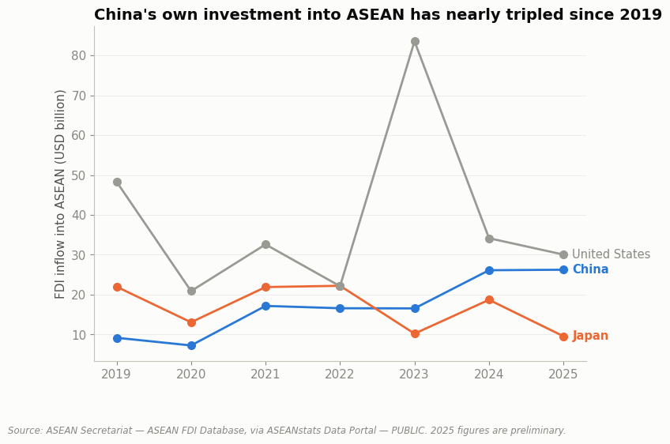

# Is Capital Really Leaving China? Global → Regional → Local (2019–2026)



## Explain It Simply

Companies move their money and factories around the world all the time, chasing lower costs, new customers, or safer bets. For the last few years, business news has repeated one story: "companies are pulling money out of China and putting it into South-East Asia instead."

This project checks whether that's actually true — three times, at three different zoom levels, like looking at a map from space, then from a plane, then from the street:

- **From space (the whole world):** Is money really leaving China for good? *Yes, a little* — but the countries gaining from it aren't the ones the story usually names.
- **From a plane (South-East Asia):** Is this region getting all that money? *Sort of* — the total isn't growing much, but *who's* sending the money is changing a lot: more of it is coming from China itself, not from Western companies "escaping" China.
- **From the street (Malaysia):** Is Malaysia specifically winning? *In one clear way, yes* (Japan is investing heavily in data centres); *in another way, it's genuinely messy* (China's investment jumps up and down for reasons that aren't fully clean to explain).

The short answer: the popular story is partly true, but the full picture is more interesting — and more useful for a business to actually act on — than the one-line version everyone repeats. (New to terms like "FDI" or "China+1"? See the [Glossary](#glossary) near the bottom.)

## The Question

The "China+1" narrative — that capital is diversifying away from China toward alternative manufacturing destinations — is now conventional business wisdom. Does it actually show up in the data, at the global level, the ASEAN regional level, and specifically in Malaysia? This case study runs the funnel top-down instead of starting from a single country, the way 001–004 did.

## Status

✅ **Analysis complete.** Three notebooks, one per layer of the funnel, each testing the narrative against a different geographic scale of public data.

## Key Findings

**1. Global: the story is real for China specifically, but the assumed beneficiary isn't "developing Asia."** China's FDI inflows fell 8% in 2025 to an estimated $107.5 billion — the third consecutive year of decline (UNCTAD). But global FDI growth in 2025 went overwhelmingly to *developed* economies (+43%), not developing ones (-2%). South-East Asia's aggregate inflows were flat (-1%), not surging. *([Notebook 01](./notebooks/01-global-fdi-trends.ipynb))*
**Why:** UNCTAD attributes much of this to one-off "conduit" money flows through financial hubs plus a boom in AI data-centre construction concentrated in rich countries — not developing economies getting genuinely weaker on their own. *(Full explanation in Notebook 01's "Why Is This Happening?" section.)*

**2. Regional: ASEAN's aggregate flatness hides a real compositional shift — China's own capital, not Western reshoring.** China's investment *into* ASEAN has nearly tripled since 2019 (+186%, to $26.2 billion), while Japan's has fallen 57% and the US's 38%. The mechanism isn't Western firms redirecting investment into South-East Asia — it's Chinese firms increasingly investing directly into the region themselves. *([Notebook 02](./notebooks/02-asean-regional-capture.ipynb))*
**Why:** Independent reporting ties this to US tariff policy — Chinese firms are building real factories inside ASEAN (not just re-routing goods through it) specifically to avoid tariffs aimed at Chinese-origin exports. *(Full explanation in Notebook 02's "Why Is This Happening?" section.)*

**3. Local: Malaysia has one sharp, real capture story (Japan) and one much noisier one (China).** Japan's Q1 2026 investment into Malaysia surged 13.8x year-on-year to RM21.5 billion, 93.6% into digital transformation — consistent with Malaysia's independent ranking as a top-ten global data-centre destination (UNCTAD). China's investment into Malaysia, by contrast, peaked in 2022 (RM55.4B), collapsed in 2023 (RM14.5B), and partially recovered in 2024 (RM28.2B) — a trajectory that mixes real investor behavior with a genuine MIDA methodology change, not a clean trend. *([Notebook 03](./notebooks/03-malaysia-local-capture.ipynb))*
**Why:** Malaysia's Johor state is absorbing data-centre investment that Singapore's own 2019–2022 building limits pushed across the border — Japan's surge is riding that regional wave, not a Malaysia-specific policy shift. *(Full explanation in Notebook 03's "Why Is This Happening?" section.)*

## Why This Project

Most commentary on "reshoring" or "China+1" cites the trend as settled fact without checking whether it holds at every geographic scale it's claimed to operate at. This project runs the same question — is capital really diversifying away from China — through three separate, independently sourced public datasets at three different scales, and reports where the popular narrative holds, where it needs qualification, and where the data available simply can't settle the question.

## Data Sources

All three datasets are labeled **PUBLIC** (an official source fetched directly) or **DERIVED** (compiled by the author from public sources, where no single downloadable series existed). Full definitions and known limitations are documented in [`DATA_DICTIONARY.md`](./DATA_DICTIONARY.md); full citations in [`references/SOURCES.md`](./references/SOURCES.md).

| Dataset | Source | Classification | Coverage |
|---|---|---|---|
| Global FDI by region | UNCTAD, Global Investment Trends Monitor No. 50 | PUBLIC | 2023–2025 |
| China's global FDI inflows | UNCTAD (same report, narrative text) | PUBLIC | 2025, with directional context |
| FDI into ASEAN by source country | ASEAN Secretariat, via ASEANstats Data Portal | PUBLIC | 2019–2025 |
| Malaysia FDI by source country | Compiled from multiple MIDA media releases | DERIVED | Uneven (FY/H1/Q1 mix), 2022–2026 |

**Data quality is uneven by design of the topic, stated plainly rather than smoothed over:** the global and regional datasets are clean structured time series from official statistical agencies; the Malaysia-specific figures had to be hand-compiled from a series of separate press releases and mix full-year, half-year, and single-quarter periods, because that is what MIDA actually published for each country in each period.

## Notebooks

| # | Question | Data Rigor |
|---|---|---|
| [01 — Global FDI Trends](./notebooks/01-global-fdi-trends.ipynb) | Is capital really leaving China, globally — and where is it actually going? | PUBLIC |
| [02 — ASEAN Regional Capture](./notebooks/02-asean-regional-capture.ipynb) | Is ASEAN capturing the shift, and from whom specifically? | PUBLIC |
| [03 — Malaysia Local Capture](./notebooks/03-malaysia-local-capture.ipynb) | Is Malaysia winning share, and does the story hold up to scrutiny? | PUBLIC + DERIVED |

## Methodology

Business problem → objectives → data acquisition → cleaning → analysis → visualization → insight → recommendation, run once per geographic layer instead of once per sub-question within a single country. Each notebook opens with the question and the answer, then shows the reasoning between them — including where the popular narrative doesn't survive contact with the data, and where the data itself isn't good enough to fully settle the question.

## Reproducing This Analysis

```bash
pip install -r requirements.txt
jupyter notebook notebooks/
```

All data used is already included in `data/processed/` — notebooks read directly from there, so no external downloads are required to re-run the analysis.

## Repository Structure

```
data/
├── raw/          # No downloadable raw files for this case study — see references/SOURCES.md
└── processed/    # Hand-compiled datasets, one file per data source
notebooks/        # Analysis notebooks
references/       # Source citations (SOURCES.md)
DATA_DICTIONARY.md
```

## Glossary

Plain-language definitions for the technical terms used in this project.

- **FDI (Foreign Direct Investment):** Money a company or investor from one country puts directly into building or buying a real business (a factory, an office, a stake in a company) in another country — not just buying shares on a stock exchange.
- **ASEAN:** A group of 11 South-East Asian countries (including Malaysia, Thailand, Vietnam, and Indonesia) that cooperate on trade and economic policy.
- **"China+1":** A business strategy where a company keeps some operations in China but adds a second country, so it isn't fully dependent on just one place.
- **Conduit flow:** Money that passes *through* a financial-hub country on its way somewhere else, which inflates that hub's own investment statistics without reflecting real new business activity there.
- **Transshipment:** Routing goods through a third country with only minimal processing, mainly to change their official "made in" label and avoid tariffs aimed at the original country.
- **PUBLIC / DERIVED / ESTIMATED:** How traceable a number in this project is. **PUBLIC** = taken directly from an official source. **DERIVED** = built by combining several official sources by hand. **ESTIMATED** = based on a secondary source that couldn't be independently verified. See [`DATA_DICTIONARY.md`](./DATA_DICTIONARY.md) for exactly how every number here was classified.

## Author

Darren Ooi — [LinkedIn](https://www.linkedin.com/in/darrenooizhixian)
